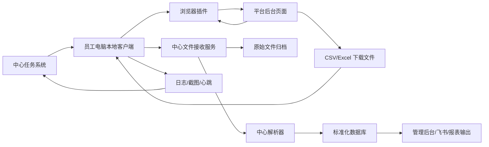

# 分布式采集 Agent 方案设计

日期：2026-06-16

## 设计目标

不要把 200 个店铺账号搬到集中采集电脑，而是把采集能力分发到账号已经登录的地方。

核心原则：

- 登录态在哪里，采集就在哪里发生。
- 员工日常账号不与集中采集电脑争抢会话。
- 中心系统只负责任务下发、状态监控、文件接收、解析清洗和汇总发布。
- 本地端不保存账号密码、cookie、token 或验证码。
- 浏览器自动化只作为 API、报表、插件提取之后的兜底手段。

## 适用平台

本方案覆盖：

- Temu
- TikTok Shop
- SHEIN
- 聚水潭
- 京东

平台数据形态分为两类：

1. 页面上可见的数据：订单、商品、库存、结算明细、店铺表现等。
2. 需要导出到本地的文件：CSV、Excel、压缩包、结算报表、财务报表、库存报表等。

## 总体架构

## 组件职责

### 中心任务系统

负责：

- 维护平台、店铺、员工、设备、任务的绑定关系；
- 生成每日采集任务；
- 下发任务给对应员工电脑；
- 记录任务状态、重试次数、失败原因和人工处理状态；
- 监控设备在线状态和客户端版本；
- 汇总每个平台的采集成功率。

中心任务状态建议：

| 状态 | 含义 |
|---|---|
| pending | 等待执行 |
| assigned | 已分配到设备 |
| running | 本地执行中 |
| waiting_user | 等待员工登录、验证码或确认 |
| uploading | 文件或数据上传中 |
| parsing | 中心解析中 |
| completed | 已完成 |
| failed | 执行失败 |
| quarantined | 数据异常，等待人工确认 |

### 本地客户端

负责：

- 拉取中心任务；
- 检查本机浏览器、插件、下载目录和网络状态；
- 监听 CSV/Excel 下载目录；
- 为本地文件补充元数据；
- 上传原始文件；
- 上传执行日志、截图和错误码；
- 在需要人工处理时提醒员工；
- 支持自动更新和版本上报。

本地客户端不负责复杂业务口径计算。它只保证“数据或文件被可靠拿到并上传”。

### 浏览器插件

负责：

- 在已登录平台页面内识别店铺和页面类型；
- 读取页面上可见的业务数据；
- 在白名单范围内监听页面接口返回的业务 JSON；
- 触发导出按钮或辅助完成报表下载；
- 把页面数据交给客户端或直接上传中心。

插件不得读取、保存或上传账号密码、cookie、token、验证码。

### 中心文件接收服务

负责：

- 接收本地上传的原始 CSV/Excel/zip；
- 生成文件 hash；
- 校验任务 ID、平台、店铺、报表类型、日期范围；
- 保存原始文件；
- 防止重复上传和重复入库；
- 将文件交给对应解析器。

### 中心解析器

负责：

- 按平台和报表类型解析文件；
- 校验表头、字段类型、日期范围和总计；
- 标准化成统一数据模型；
- 识别格式变更；
- 将异常文件隔离到 quarantine；
- 保留原始文件、解析版本和数据血缘。

## 三种实施形态

### 形态一：浏览器插件

适合页面展示数据较多、导出文件较少的场景。优点是轻量，不需要强本地权限；缺点是本地文件处理和定时能力弱。

### 形态二：本地客户端

适合 CSV/Excel 导出为主的场景。优点是文件处理、上传、日志、重试、截图和定时能力强；缺点是需要安装、升级和处理杀毒软件/权限问题。

### 形态三：插件 + 客户端

适合 Temu、TikTok Shop、SHEIN、聚水潭、京东混合场景。插件负责页面和接口数据，客户端负责文件和任务管理，中心负责解析汇总。该方案复杂度最高，但最符合 200 店铺规模化要求。

## MVP 建议

第一版不建议一次性实现完整插件 + 客户端闭环。推荐按风险从低到高推进：

1. 本地客户端下载目录监听 + 手动导出文件上传。
2. 中心原始文件归档 + 统一解析 + 去重入库。
3. 客户端任务下发和状态回传。
4. 浏览器插件辅助识别平台、店铺和页面数据。
5. 插件触发导出或读取接口响应。
6. 对稳定平台增加半自动或自动采集。

MVP 首要目标不是完全无人值守，而是证明：

- 不需要集中登录 200 个账号；
- 不新增大量手机号；
- 每天能稳定把分散在员工电脑上的报表集中到中心；
- 失败和缺失能被后台发现。

## 数据流

1. 中心系统生成当日任务。
2. 本地客户端拉取属于本设备/员工/店铺的任务。
3. 员工或客户端打开平台后台。
4. 插件识别页面数据或触发导出。
5. 文件下载到本地目录。
6. 客户端监听到新文件，计算 hash 并补充元数据。
7. 客户端上传原始文件和任务日志。
8. 中心保存原始文件。
9. 中心解析器解析、校验、入库。
10. 管理后台展示店铺采集状态和异常。

## 店铺和设备绑定

建议建立以下绑定关系：

| 对象 | 说明 |
|---|---|
| employee | 员工或负责账号的人 |
| device | 员工电脑或云桌面 |
| platform_account | 平台账号，不保存密码 |
| shop | 店铺 |
| task_profile | 该店铺需要采集的报表和页面 |
| collection_window | 推荐采集时间段 |

一个员工可绑定多个店铺，一个设备可承载多个平台账号，但中心必须知道某个任务应该发到哪台设备执行。

## 异常处理

| 异常 | 处理 |
|---|---|
| 设备离线 | 任务保持 pending，提醒负责人，允许补采 |
| 未登录 | 转为 waiting_user，提示员工登录 |
| 需要验证码 | 转为 waiting_user，不绕过验证码 |
| 文件未下载 | 记录页面截图和下载目录快照 |
| 文件重复 | hash 去重，任务幂等完成 |
| 表头变化 | quarantine，等待解析器更新 |
| 数据校验失败 | quarantine，保留原始文件和错误明细 |

## 与现有代码的关系

当前集中式采集代码仍可保留，但后续定位调整为：

- API 方案的本地/中心服务底座；
- 手动上传和报表解析能力；
- 少量账号或异常任务的浏览器兜底；
- 中心任务调度和发布通道。

后续新增分布式能力时，应尽量复用：

- parser；
- archive artifact；
- normalized repository；
- manual artifact routes；
- scheduler；
- admin 状态页。

## 待确认问题

- 客户是否允许在员工电脑安装客户端和浏览器插件；
- 员工是否每天会打开相关平台后台；
- 下载目录是否可以统一；
- 原始文件允许上传到哪里；
- 是否需要只在局域网内运行中心服务；
- 是否需要云端中心服务；
- 200 店铺下每日报表体量、带宽和存储成本；
- 是否需要代码签名和企业分发机制。
