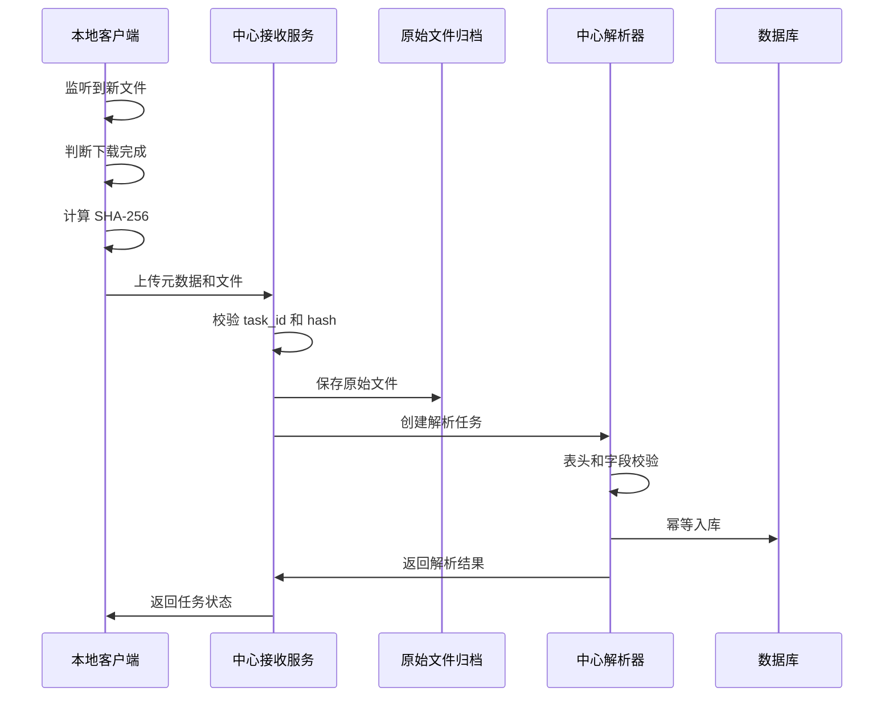

# 本地文件集中接入规格

日期：2026-06-16

## 目的

当平台 API 不完整、子账号成本不可接受，且部分数据必须从平台后台导出 CSV/Excel 时，系统需要支持分布在员工电脑上的本地文件集中处理。

该规格定义本地文件从下载、识别、上传、归档、解析、去重到入库的最小闭环。

## 范围

覆盖文件类型：

- CSV
- XLSX
- XLS
- ZIP 中的 CSV/Excel
- 平台导出的压缩报表包

覆盖平台：

- Temu
- TikTok Shop
- SHEIN
- 聚水潭
- 京东

## 设计原则

- 本地端只负责可靠获取和上传文件。
- 中心端负责业务解析、字段映射和入库。
- 原始文件必须归档，解析结果必须可追溯到原始文件。
- 任何格式变化不得静默入库。
- 同一文件重复上传不得重复入库。
- 文件元数据必须独立于文件名保存，因为平台导出文件名可能不稳定。

## 本地文件元数据

客户端上传文件时必须附带以下元数据：

| 字段 | 必填 | 说明 |
|---|---|---|
| task_id | 是 | 中心任务 ID |
| platform | 是 | 平台，如 Temu、TikTok Shop、SHEIN、聚水潭、京东 |
| shop_id | 否 | 系统内部店铺 ID，无法识别时为空 |
| shop_name | 否 | 页面或员工选择的店铺名 |
| report_type | 是 | 报表类型，如 orders、finance、inventory |
| business_date_start | 否 | 报表业务开始日期 |
| business_date_end | 否 | 报表业务结束日期 |
| employee_id | 否 | 员工 ID |
| device_id | 是 | 设备 ID |
| local_file_name | 是 | 本地文件名 |
| local_file_path | 否 | 本地路径，仅用于本机日志，不建议上传到外部系统 |
| downloaded_at | 否 | 本地检测到文件完成下载的时间 |
| uploaded_at | 是 | 上传时间 |
| file_size | 是 | 文件大小 |
| file_hash_sha256 | 是 | SHA-256 |
| client_version | 是 | 客户端版本 |
| plugin_version | 否 | 插件版本 |
| source_page_url | 否 | 触发下载的页面 URL，可脱敏 |
| notes | 否 | 备注 |

## 文件识别策略

文件识别优先级：

1. 中心任务明确指定平台、店铺、报表类型和日期范围。
2. 插件从页面上下文传递平台、店铺和报表类型。
3. 客户端根据下载时间和当前任务窗口关联文件。
4. 文件名规则辅助识别。
5. 文件内容表头辅助识别。
6. 无法识别时进入 unknown 队列，等待人工确认。

不建议只依赖文件名。平台导出的文件名可能因语言、站点、账号、浏览器或版本变化而变化。

## 下载完成判断

客户端下载目录监听时，应避免上传未完成文件。

推荐判断：

- 排除 `.crdownload`、`.tmp`、`.download` 等临时文件；
- 文件大小在连续两个检查周期内不再变化；
- 最后修改时间距离当前时间超过安全窗口，例如 3 到 5 秒；
- 对大型文件可使用更长稳定窗口；
- 记录检测开始、检测完成和上传开始时间。

## 上传流程



## 去重和幂等

文件级去重：

- `file_hash_sha256`
- `file_size`
- `platform`
- `shop_id`
- `report_type`

业务级去重：

- 订单类：`platform + shop_id + order_id + line_item_id`
- 财务类：`platform + shop_id + statement_id + transaction_id`
- 库存类：`platform + shop_id + sku + warehouse + business_date`
- 商品类：`platform + shop_id + product_id + sku`

任务级幂等：

- 同一 `task_id` 多次上传同一文件，返回已完成。
- 同一任务上传不同文件时，保留全部原始文件，并要求中心判断是否替换、合并或隔离。

## 中心解析要求

每个解析器必须执行：

- 文件编码检测；
- 表头校验；
- 必填列校验；
- 日期范围校验；
- 数字、金额、币种和百分比字段类型校验；
- 空文件处理；
- 重复行处理；
- 总计或行数校验，如果平台报表提供总计；
- 解析版本记录；
- 原始文件到标准化记录的数据血缘记录。

解析结果状态：

| 状态 | 含义 |
|---|---|
| parsed | 解析成功 |
| parsed_with_warnings | 解析成功但存在可接受警告 |
| quarantined | 异常隔离，不入正式表 |
| unsupported_format | 文件格式不支持 |
| unknown_report | 无法识别报表类型 |
| duplicate | 重复文件或重复业务数据 |

## 异常隔离

以下情况必须进入 quarantine：

- 表头缺失或疑似改版；
- 必填字段缺失；
- 金额、数量、日期字段无法解析；
- 店铺或日期范围无法确认；
- 文件内容与任务元数据不匹配；
- 解析结果行数为 0，但文件并非空报表；
- 同一任务出现多个互相冲突的文件。

quarantine 记录必须包含：

- 原始文件 ID；
- 任务 ID；
- 平台；
- 店铺；
- 报表类型；
- 错误码；
- 错误详情；
- 解析器版本；
- 上传设备和员工；
- 处理状态。

## 原始文件保存

建议保存结构：

```text
artifacts/
  raw/
    platform/
      shop_id/
        report_type/
          yyyy-mm-dd/
            task_id__hash__original_filename
```

注意：

- 原始文件不得提交到公共 GitHub。
- 用于测试的 fixture 必须脱敏。
- 真实客户数据只能保存在客户授权的位置。

## 管理后台最小能力

管理后台至少需要展示：

- 当日应采任务数、已完成数、失败数、等待人工数；
- 每个平台和每个店铺的采集状态；
- 最近上传文件；
- 解析成功/失败原因；
- 设备在线状态；
- 客户端版本；
- quarantine 队列；
- 重跑解析和重新上传入口。

## MVP 验收标准

第一版本地文件接入至少满足：

- 员工可手动导出一个平台报表到本地；
- 客户端自动识别并上传文件；
- 中心保存原始文件；
- 中心解析并入库；
- 同一文件重复上传不重复入库；
- 表头变化会失败并进入 quarantine；
- 管理后台能看到任务状态和错误原因。
